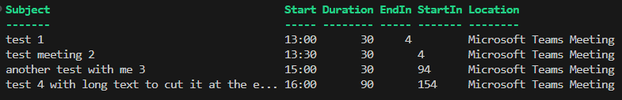

# PowerShell Outlook Calendarevents Widget
This script list the next events in my Outlook calendar of today. I use it as "quick and dirty" widget on my side screen, because Microsoft is not having widgets at the moment.

## Status
Working.

Now also including recurring events like weeklys and the timespans to start and end in minutes.

## Example

## What i'm not happy with 
Due to the fact that its a console application on every refresh the whole list gets rewritten. 

But having this running on a side display (whats i do) means, that the refreh can be catched by the eye and this can be distracting.

Without the EndIn and StartIn columns the refreh can be every 10+ minutes what helps with this, but with these calculated values it must be refreshed every minute.

Would be cool to update the script, that its only the backend updating a database like SQLite and then have a frontend showing the data with refreshs only on component level.

## error
if you see something like this, just wait or restart the script. I guess it i caused when Outlook is not ready yet.

